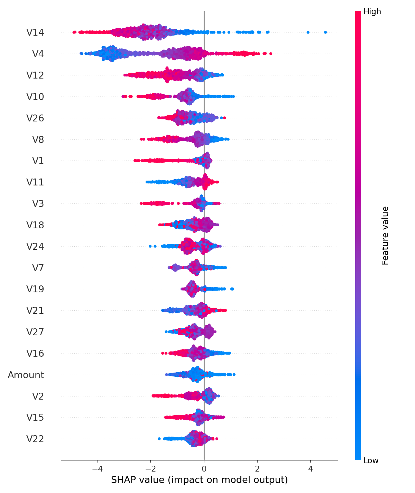

# Fraud Detection (Pro) — Portfolio Project

A polished project to demonstrate **ML on imbalanced tabular data**, **business-aware thresholding**, and **explainability** with a **Streamlit demo**.

## Highlights
- Dataset: Kaggle **Credit Card Fraud Detection** (284,807 rows; 0.172% fraud)
- Metrics: **PR-AUC**, Recall@low-FPR
- Threshold: optimized by **business cost** (false negatives >> false positives)
- Models: Logistic Regression (balanced) and **XGBoost** (tree-based)
- Explainability: **SHAP** (for XGBoost) in the app

## Quickstart

### 1) Environment
```bash
make setup
```

### 2) Data
Download Kaggle dataset *Credit Card Fraud Detection* and place CSV as:
```
data/creditcard.csv
```

### 3) Train
- Logistic Regression:
```bash
make train
```
- XGBoost + SHAP:
```bash
make train_xgb
```

### 4) Run the app
```bash
make app
```

The app auto-loads **XGBoost** model if `model_xgb.joblib` exists, else falls back to LR (`model.joblib`).

## Repo structure
```
fraud-detection-pro/
├─ app/
│  └─ streamlit_app.py
├─ data/
│  └─ creditcard.csv  # you add this
├─ reports/
│  ├─ metrics.md
│  ├─ shap.beeswarm.png
├─ src/
│  ├─ report.py    
│  ├─ train_lr.py
│  ├─ train_xgb.py
│  └─ utils.py
├─ tests/
│  └─ test_smoke.py
├─ .gitignore
├─ Makefile
├─ requirements.txt
└─ README.md
```

## Notes
- The anonymized PCA-like features (V1..V28) are fine for modeling.  
- SHAP explanations are shown when the XGBoost model is loaded.
- For interviews, emphasize **PR-AUC**, **cost-based operating point**, and a **recall@low-FPR** number.

## Results
- **PR-AUC**: 0.8756
- **Operating threshold**: 0.125 (cost_fp=5.0, cost_fn=500.0)
- **Precision/Recall/F1 @ thr**: 0.626 / 0.888 / 0.734
- **Confusion matrix @ thr**: TP=87 | FP=52 | FN=11 | TN=56812
- **Estimated cost @ thr**: 5760.0


